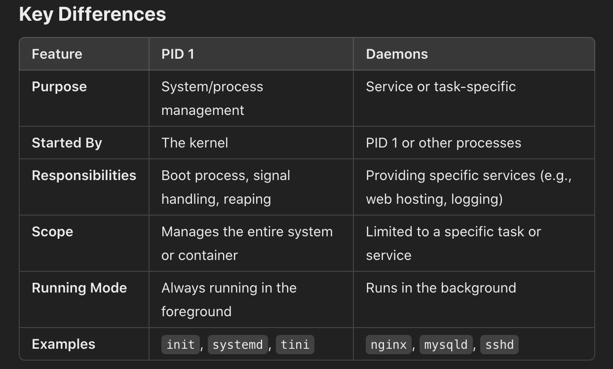

# What is Docker?
* Docker is an open platfrom for developing, shupping, and running applications.
* Docker enables you to separate your applications from your infrastructure so 
  you can deliver software quickly.
* Docker is a tool for running applications in an isolated environment.
* With docker we can easily package up our application with everything it needs
  and run it anywhere on any machine.
* Docker is written in the Go programming language
* Docker uses a technology called namespaces to provide the isolated workspace 
  called the container. When you run a container, Docker creates a set of namespaces 
  for that container. These namespaces provide a layer of isolation. Each aspect of a 
  container runs in a separate namespace and its access is limited to that namespace.

# What can I use Docker for?
    1- Application Containerization
    2- Development and Testing
    3- Streamlining Deployment
    4- Microservices Architecture
    5- Continuous Integration/Continuous Deployment (CI/CD)
    6- Cloud-Native Applications

# Docker architecture
    * Docker uses a client-server architecture
    * The Docker client talks to the Docker daemon
    * The Docker client and daemon can run on the same system, or you can 
      connect a Docker client to a remote Docker daemon
    * The Docker client and daemon communicate using a REST API
      calls over Http (over UNIX sockets or a network interface).
    1- Docker client
        * The interface that developers use to interact with docker 
        * Sends commands (docker build, run, pull ...) to the Docker
          Daemon using REST API class over HTTP
        * Example tools: Command Line Interface (CLI), Docker Desktop.
    2- Docker Daemon: (dockerd)
        * The core component of docker running on the host system
          responsible for managing Docker objects (containers, images, 
          volumes, ...).
        * Listens to requests from the Docker Client, executes them
          and communicates with the underliying operating system to manage
          containers
    3- Docker Desktop:
        * it provides a straightforward GUI (Graphical User Interface) that
          lets you manage your containers, applications and images directly 
          from your machine
        * Docker Desktop reduces the time spent on complex setups so you can 
          focus on writing code.
    4- Docker registries:
        * A docker registries stores Docker images 
        * Docker Hub ia s public registry that anyone can use and Docker looks 
          for images on Docker Hub by default, you can even run your own private registry
        * When you use the docker pull or docker run commands, docker pulls the required
          images from your configured registry
    5- Docker Images:
        * Read only templates that define what's inside a container, including
          the application, libraries, and dependencies
        * Ofen an image is based on another images, with some additional customization
        * Images are built using a Dockerfile(defining the steps needed to create the image)
        * Each instructions in a Dockerfile creates a layer in the image, When you change 
          the Dockerfile and rebuild the image only those layers which have changed are rebuilt
          this part of what makes images so lightweight small and fast when compared to other
          virtualization technologies.
    6- Docker Containers
        * Lightweight, portable and isolated instances of an images that run the application
        * Containers share the host OS kernel, making them more efficient that virtual machines.
    7- Docker Engine
        * The runtime that combines the Docker Daemon, CLI, and APIs to manage containers and images
        * Processes commands and integrates with the operating system to execute containerized workloads
        * Docker Engine is the complete package for running Docker
        * Components of Docker Engine:
            - Docker Daemon (dockerd)
            - Docker Client
            - REST API 
    8- Underlying Operating System:
        * The host system where Docker runs
        * Provides the kernel features (like namsecpaces cgourps) that Docker uses to 
          isolate and manage containers.

# Diagram of Docker Architecture:
    Docker Client
        ↓
    Docker REST API
        ↓
    Docker Daemon
        ↙︎       ↘︎
    Images      Containers
        ↓           ↓
    Registry     Host OS Kernel

# Summary of Workflow:
* A user interacts with the Docker Client.
* The client sends commands to the Docker Daemon via the REST API.
* The daemon pulls or pushes images from/to the Docker Registry.
* The daemon creates and manages Docker Containers based on the images.
* The containers run isolated applications, leveraging the Host OS Kernel for resource management.

# difference between containers and virtual machines (VMs):
* Virtual machine:
    * include a full operating system with its own kernel
    * each VM has its own dedicated resources
    * VMs take longer to start because the guest OS needs to boot 
    * Ideal for running multiple different operating systems or
      applications requiring strong isolation
    * VMs are typically gigabytes in size since they include the entire OS
* Containers:
    * share the host OS kernel and only package the necessary application
      code and dependencies, they are more lightweight since they don't 
      need a full OS
    * start almost instantly (seconds) and use fewer resources
    * Containers are usually megabytes since they only contain application code and dependencies
* Uses Cases:
                
                VMs
    - Running applications that need different OS types(Windows, Linux, ..)
    - Complete isolation requirements.
    - Legacy systems (Legacy applications that need specific OS environments)              

            Containers
    - Microservices architecture.
    - DevOps and CI/CD pipelines.
    - Applications that need rapid scaling.
    - Cloud-native applications.

# PID 1:
* PID 1 is the first process that is started by the kernel during the boot 
  process it plays a crucial role in system initilization and process management 
* PID stands for Process ID. Every program or process running on your computer gets 
  a unique number called a PID
* Why is PID 1 Special?
  - Lifecycle Role: 
    as the first process it persists for the entire uptime of the system if PID 1
    crashes, the system will typically panic or become unstable .
  - System Signals:
    PID 1 is treated specially by the kernel and receives signals like SIGINT, 
    SIGTERM and SIGKILL directly during system shutdown.
  - PID 1 is the parent of all processes. when your computers starts, the operating system's
    kernel (the core part of the OS) runs a program to get everything going. this first
    program is assigned PID1
  - On most systems, PID 1 is a program called init or a modern replacement like systemd

* PID 1 is the cornerstone of process management in Linux. It starts the user space, 
  initializes services, and ensures process cleanup. In containers, PID 1 behaves 
  similarly but often requires special attention to handle signals and manage processes 
  effectively.

* What does PID 1 do?
  - Starts other processes: it launches all the eseential programs your computers needs to work
                            like networking, user interfaces, etc.
  - Manages processes: if a program crashes or its parent process stops, PID 1 steps 
                       in to adopt it and clean it up
  - Keeps the system stable: Since PID 1 is always running, if it fials or crashes, 
                      the entire system might stop working .

* PID 1 in Docker Containers:
  - In Docker containers, PID 1 plays a critical role because it is the first process that 
    runs when the container starts
  - In Docker the process defined in the conatiner's ENRTYPOINT or CMD 
    becomes the conatiner's PID 1
  - When working with servers, containers (like Docker), or debugging, you'll often interact 
    with PID 1 because it controls how the system or container starts and behaves.
  - In Docker, for example, if your main process doesn't run as PID 1, it can cause issues 
    with managing signals like stopping or restarting the container.
* The container’s PID 1 is independent of the VM’s PID 1.

# Daemons:
* A daemon is a background process that runs continuously, usually to 
  perform a specific service or function such as:
  - Serving web pages (nginx, httpd)
  - Managing databases (mysqld, postgres).

# Docker Compose:
* Docker Compose is a tool for defining and running multi-container applications.
* Docker Compose is a tool that simplifies the management of multi-container
  Docker applications. it allows you to define and run multiple services in a 
  single file called Docker-compose.yml
* With compose you can define how your application components interact, their 
  configurations and network settings, enabling you todeploy comple applications
  more easily.

# Docker Volumes:
* Volumes are persistent data stores for containers created and managed by Docker.
* Docker containers are ephemeral, meaning that any data inside the container is lost
  when the container is removed.
* Volumes allow you to persist data across container restarts and even container removals.

# Why Use Docker Volumes? 
1- Data Persistence
2- Data Sharing
3- Backup and Restore
4- Isolation

# Types of Volumes in Docker:
*  Named Volumes: these are Docker-managed volumes with a specific name. Docker automatically
   handles the location and management of the volume.
   - Example : my_app_data:/app/data.
   - Docker will automatically create the volume my_app_data if it doesn't exist. The volume will 
   be stored in the default Docker volume directory (e.g., /var/lib/docker/volumes/ on Linux). 
   You don't need to worry about the underlying directory on the host.
*  Anonymous Volumes: These are volumes that Docker automatically creates when not explicitly
   named they are used for temporary storage.
   - Example : /container_path
   - /container_path: This specifies the path inside the container where Docker will automatically mount 
   an anonymous volume.
   Docker will create an anonymous volume on the fly and mount it to /container_path inside the container.
*  Host-Mounted Volumes: these are volumes that are mapped directly to the host system's
   directly or file.
   - Example : ./local_data:/app/local_data
   - In this case, ./local_data is a directory on your host machine (relative to the current directory). 
   This means any changes made to the files in this directory on the host will be reflected inside the 
   container, and vice versa

# Docker Networking
* Container networking refers to the ability for containers to connect to and communicate with each other
* Docker networking allows containers to communicate with each other, the host machine, and external networks.

# Types of Docker Networks
* Bridge Network (Default):
  - Is the default network type in Docker. it's a private and isolated virtual network created by Docker
    on the host machine By default:
  - Containers connected to the same bridge network can communicate with each other directly.
  - Containers on different networks or on the host cannot communicate unless explicitly configured.
  - External communication (e.g., accessing the internet or services on the host) requires port mapping.
* Host Network:
  - the container shares the same network namespace as the host, meaning it directly accesses 
    the host’s networking  stack.
  - How It Works: The container uses the host’s IP address and network interfaces for communication. 
    No isolation is provided between the container and the host's network.
* None Network
  - This driver disables all networking for the container. The container has no access to the network.